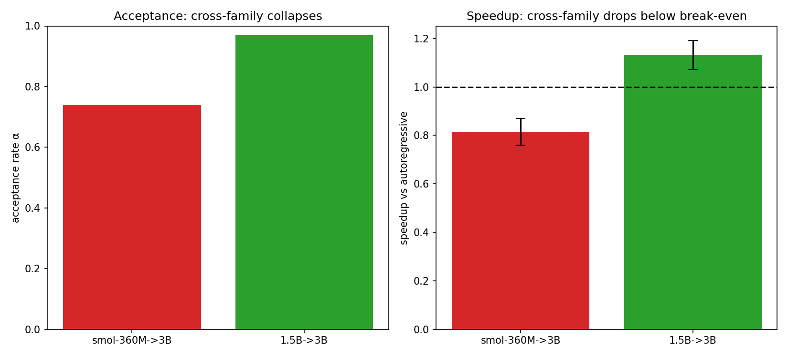
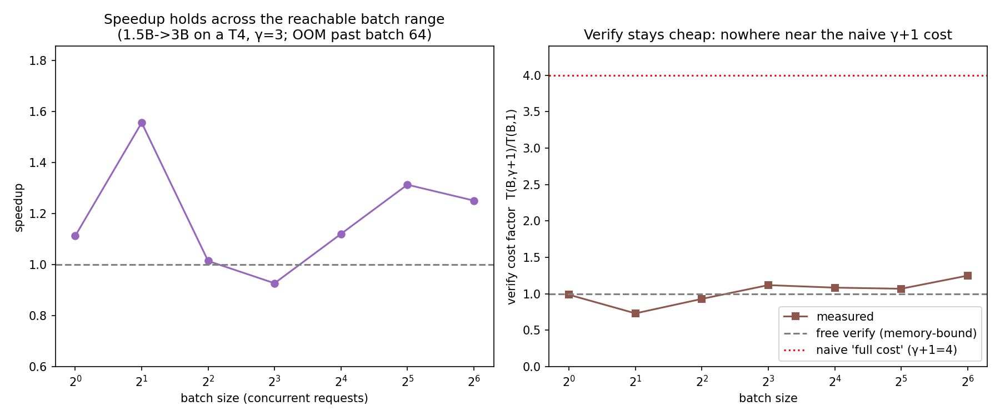

# When does speculative decoding pay off — and does it survive serving load?

A from-scratch implementation and empirical characterization of speculative
decoding on the Qwen2.5-Coder family, run on a real benchmark across two very
different pieces of hardware (Apple M-series MPS and an NVIDIA T4). Companion to
[llm-bug-introspection](https://github.com/nazanindev/llm-bug-introspection).

## Abstract

Speculative decoding accelerates LLM inference by letting a small *draft* model
propose tokens a large *target* model verifies in one parallel pass; the target's
output is provably unchanged, only faster. Whether it is actually faster depends
on how often the draft agrees with the target (acceptance rate α) and how cheap
the draft is relative to the target (cost ratio c). We implement it from scratch
(greedy, sampled, and cross-tokenizer variants, with explicit KV-cache management)
and characterize it on a real benchmark (HumanEval for code, Dolly for prose),
using a **predict → verify** method: measure α and latency, predict the speedup
and optimal draft length γ from the speculative-sampling model, then confirm with
the real decoder. Findings: (1) greedy speedup is predicted and measured, with an
optimum at **γ=3**; (2) acceptance is strongly **domain-dependent** (code α≈0.97
vs prose ≈0.75); (3) sampled speculation is **distribution-correct** (total
variation to target sampling below the sampling-noise floor); (4) a **cross-family
draft** (a non-Qwen model bridged through text) is correct but *loses* — a shared
tokenizer is what makes a pair pay off; (5) on the **serving** axis, contrary to
the naive roofline, the verify pass stays cheap across the whole batch range we
could reach, so speculation is robust to batching on this hardware. Two honest
self-corrections are documented: a "non-monotonic latency" finding that was
measurement noise, and the serving rolloff hypothesis that the data refuted.

## Method

**Models.** Qwen2.5-Coder-Instruct at 0.5B / 1.5B / 3B / 7B (shared tokenizer,
which is what makes them valid draft/target pairs), plus SmolLM2-360M as a
different-family draft. fp16.

**Platforms.** Apple MPS (full 0.5B–7B ladder) and a free Colab **NVIDIA T4**
(16GB, so up to the 3B target). Results below are the T4 + real-benchmark run
unless noted; the MPS numbers appear in the cross-platform comparison.

**Benchmark.** HumanEval problems (code, the target domain) and Dolly `open_qa`
instructions (prose, an off-domain contrast), cached for reproducibility.

**Two empirical inputs** (`scripts/01_acceptance.py`): per-token latency (median
of trials), and acceptance rate α = P(draft's greedy next token == target's),
teacher-forced on the target's own continuation — exactly the α in the speedup
model — with a bootstrap 95% CI over prompts.

**Prediction** (`specdec/theory.py`, Leviathan et al. 2023): expected emitted
tokens `E = (1−α^(γ+1))/(1−α)`, cost `(γ·c + 1)` target-forwards, so
`speedup = E / (γ·c + 1)`, maximized over γ.

**Verification** (`specdec/decode.py`, `decode_cross.py`): from-scratch decoders
with explicit KV-cache rollback (each cache tracks its own length and re-feeds the
uncovered "gap" after a rejection). Greedy speculation is *exact* — output equals
baseline greedy token-for-token, a built-in correctness check. Sampled speculation
uses the probabilistic accept/residual rule and is checked *distributionally*.

## Results

**Where it pays off.** Predicted speedup for every (draft→target, domain); above
the dashed line is a win. Against the 3B target every small draft clears
break-even on code; prose is marginal.


**Acceptance is domain-dependent.** Code α≈0.97, prose α≈0.70–0.81, with
non-overlapping CIs — the draft tracks the target far better on code, which is why
prose barely clears break-even.


**Predicted vs measured γ-sweep** (1.5B→3B, code). The real decoder reproduces the
predicted curve: an optimum at **γ=3**, then a plateau.


| γ | measured speedup (95% CI) | accepted/iter | exact output |
|---|---|---|---|
| 1 | 1.17× [1.13, 1.21] | 0.99 | 28/30 |
| 2 | 1.17× [1.13, 1.21] | 1.94 | 30/30 |
| **3** | **1.20× [1.16, 1.25]** | 2.94 | 30/30 |
| 4 | 1.18× [1.13, 1.22] | 3.86 | 30/30 |
| 5 | 1.17× [1.12, 1.22] | 4.72 | 30/30 |
| 6 | 1.12× [1.07, 1.18] | 5.53 | 30/30 |

Greedy speculation is exact: output was token-identical to baseline greedy on 28–30
of 30 prompts (the rare mismatch is an fp16 argmax tie on the target, not a logic
error). The 3B target's gain (1.20×) is smaller than the 7B's on MPS (≈1.5×) —
a bigger target has more per-token cost to amortize, so speculation buys more.

**Sampled (non-greedy) speculation is distribution-correct.** With the
probabilistic accept/residual rule the output is distributed like sampling the
target directly: the speculative first-token distribution sits at TV = 0.033 from
the target's — *below* the 0.067 baseline-vs-baseline noise floor. Speedup is
roughly flat in temperature (α falls only mildly, 0.98→0.92, as T rises).


**Cross-tokenizer speculation is correct but loses.** A non-Qwen draft
(SmolLM2-360M) has no shared vocabulary, so it drafts through a decode→re-encode
text bridge; verification stays in the target's token space, so output is still
exactly target-greedy (20/20). But acceptance collapses (0.97 same-family → 0.74
cross-family) and the net is **0.81× — a slowdown.** A shared tokenizer is what
makes a draft/target pair worth it.



**Serving: does the speedup survive batching?** Speculative decoding is usually
measured at batch = 1 (one request, memory-bound, where the verify is nearly
free). A real server batches requests, which should drive the GPU compute-bound
and make the verify of γ+1 tokens cost up to γ+1× a decode step. We measured the
target's forward latency vs batch and chunk to test this. **It did not happen in
the reachable range:** the verify cost factor stayed near 1 (far below the naive
γ+1 = 4), and speculation held ~1.1–1.4× all the way to batch 64, where the T4
runs out of memory.



Why the naive rolloff didn't appear: at these batch sizes a forward's cost is
dominated by weight-loading, attention, and fixed per-batch overhead — adding 3
verify tokens to the sequence dimension barely moves it, and single-token decode
is itself GEMV-inefficient, so the baseline isn't cheap either. Both scale
together, so the ratio stays ≈1. The textbook throughput rolloff is real but lives
at much larger batch (where wasted draft/verify compute competes with other
requests for a saturated GPU) — beyond what a 16GB T4 with a 3B model reaches.
**This refuted our initial hypothesis; we report the measurement, not the guess.**

**Cross-platform.** Per-token latency (median): MPS 0.5B 17 / 1.5B 19 / 3B 22 /
7B 38 ms; T4 0.5B 33 / 1.5B 39 / 3B 55 ms. The free T4 is an older card — an
**Apple M-series chip is actually faster per token for these small models at batch
1**, a memory-bandwidth regime where it competes well. The full ladder (including
the 7B target, ≈1.5× best speedup) runs on MPS; the T4 is capped at 3B by memory.
An earlier single-trial latency reading had the 0.5B as the *slowest* model;
median-of-trials showed that was noise — a reminder to bootstrap your timings.

## Conclusions

Speculative decoding's payoff is set by acceptance (α) and relative draft cost
(c), and both move with the model pair, the workload, and the hardware. A
two-measurement analytic model predicts the optimal γ and the wall-clock speedup;
acceptance is high and stable on in-domain (code) text and weaker off-domain; the
technique's exactness (greedy) / distribution-correctness (sampled) makes it safe
to deploy; and a shared tokenizer is what keeps acceptance high enough to pay. On
the serving axis, the intuition that batching kills speculative decoding did *not*
hold on this hardware — the verify stayed cheap and the speedup was robust across
the batch range we could reach. The honest scope: the production-scale throughput
regime, where the rolloff is expected, needs a larger GPU than this study used.

## Limitations

- **Serving rolloff not reached.** The T4 (16GB) OOMs past batch 64 with a 3B
  model, before the compute-bound regime where the throughput rolloff is expected.
  This is a hardware limit, not evidence the rolloff doesn't exist at scale.
- Cross-platform comparison mixes an earlier MPS run and the T4 benchmark run;
  the headline numbers are the consistent T4 + HumanEval/Dolly run.
- Two implementation overheads understate measured speedups: the sampled decoder
  samples on CPU, and the cross-tokenizer draft keeps no KV cache. Neither affects
  the (exact / distribution-correct) outputs.
- One target family (Qwen2.5-Coder); short generations; α averaged over positions.

## Related work
- Leviathan, Kalman, Matias, *Fast Inference from Transformers via Speculative
  Decoding*, ICML 2023 — the acceptance/speedup model used here.
  [arXiv:2211.17192](https://arxiv.org/abs/2211.17192)
- Chen et al., *Accelerating Large Language Model Decoding with Speculative
  Sampling*, 2023. [arXiv:2302.01318](https://arxiv.org/abs/2302.01318)

## Reproduce

```sh
pip install -r requirements.txt
python scripts/01_acceptance.py          # latency + alpha (CIs) -> data/measurements.json
python scripts/04_sweep.py 1.5B 3B       # measured greedy gamma-sweep -> data/sweep.json
python scripts/05_sampled.py 1.5B 3B     # sampled: correctness + temperature -> data/sampled.json
python scripts/06_cross.py 3B 1.5B       # cross-tokenizer draft (downloads SmolLM2-360M)
python scripts/07_serving.py 1.5B 3B     # serving roofline (speedup vs batch)
python scripts/03_figures.py             # figures
python -m specdec.configure 1.5B 3B code 1   # deploy decision for a config
```

Runs on CPU / Apple MPS / CUDA (auto-detected). For a real GPU, open
`gpu_run.ipynb` in Colab (it auto-scopes the target to the GPU's memory).

## Repository

```
llm-speculative-decoding/
├── specdec/
│   ├── models.py       # load the ladder + a non-Qwen draft; device/dtype (cuda/mps/cpu)
│   ├── measure.py      # per-token latency, acceptance alpha, serving forward-latency
│   ├── theory.py       # Leviathan speedup model, optimal-gamma
│   ├── decode.py       # from-scratch greedy + sampled baseline/speculative decoders
│   ├── decode_cross.py # cross-tokenizer speculation (decode->re-encode bridge)
│   ├── configure.py    # recommend(draft, target, domain, batch) -> deploy decision
│   ├── stats.py        # bootstrap CIs, median/IQR
│   └── prompts.py      # HumanEval / Dolly loaders (+ demo lists)
├── scripts/            # 01 measure · 02 verify · 03 figures · 04 sweep · 05 sampled · 06 cross · 07 serving
├── gpu_run.ipynb       # one-click Colab GPU run
└── figures/
```
