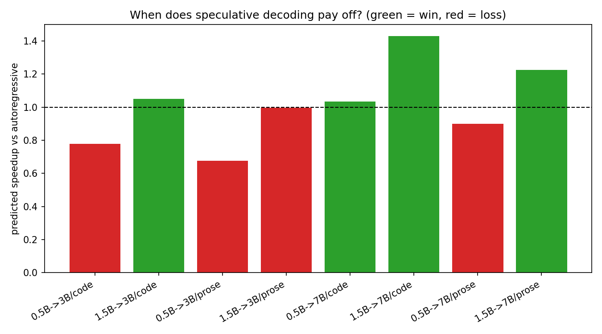
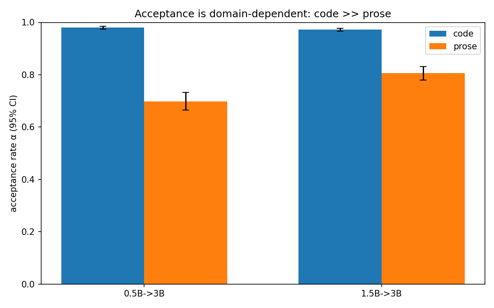
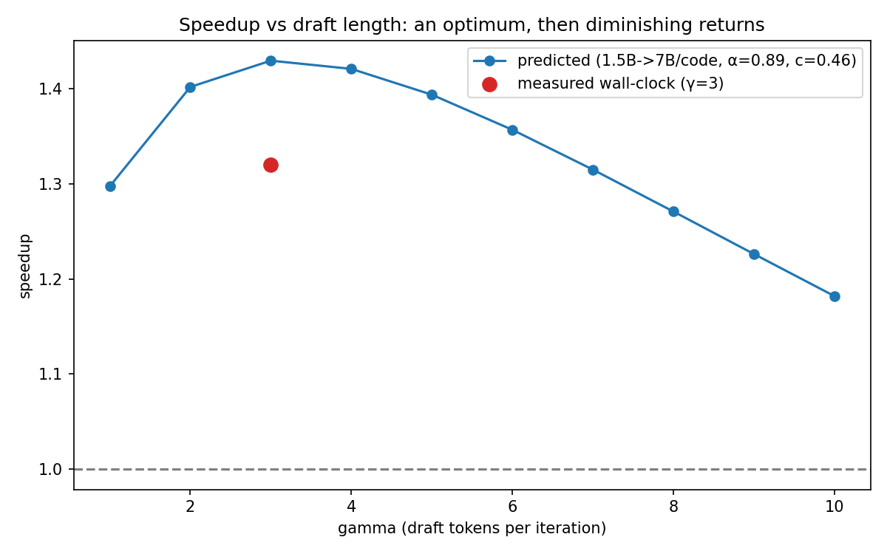
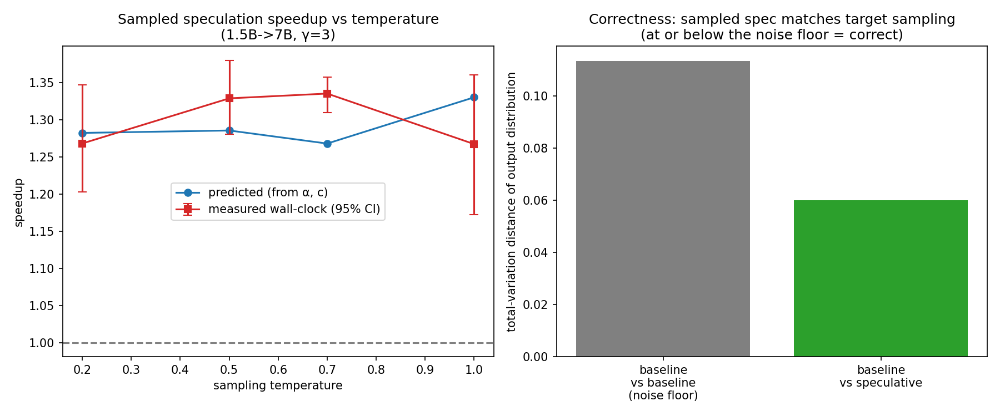

# When does speculative decoding actually pay off?

A from-scratch implementation and empirical characterization of speculative
decoding on the Qwen2.5-Coder family, run locally on Apple Silicon. Companion to
[llm-bug-introspection](https://github.com/nazanindev/llm-bug-introspection).

## Abstract

Speculative decoding speeds up LLM inference by letting a small *draft* model
propose several tokens that a large *target* model verifies in a single parallel
forward pass; the target's output is provably unchanged, but it runs in fewer
sequential steps. Whether it is actually *faster* depends on two competing
quantities: how often the draft agrees with the target (acceptance rate α) and how
cheap the draft is relative to the target (cost ratio c). We characterize this
trade-off on the Qwen2.5-Coder family (0.5B–7B) on an Apple-Silicon (MPS) device.
We measure α and per-token latency directly (with bootstrap CIs and
median-of-trials timing), **predict** the speedup and optimal draft length γ from
the standard speculative-sampling model, then **verify** the prediction with a
from-scratch greedy speculative decoder. The measured wall-clock speedup tracks
the prediction in both shape and optimum (best config 1.5B→7B on code: predicted
optimum γ=3, measured **1.51× [1.46, 1.56]**, output token-identical to baseline).
Two findings are practical: (1) per-token latency is **overhead-bound and nearly
flat** across the small models (0.5B–3B differ <25% despite 6× the parameters), so
the cost ratio — and the decision to speculate at all — is dominated by the
*target* size; (2) acceptance is strongly **domain-dependent** (code α≈0.9 vs prose
α≈0.65), so the same draft/target pair that wins on code is marginal on prose.

## Method

**Models.** Qwen2.5-Coder-Instruct at 0.5B / 1.5B / 3B / 7B (shared tokenizer,
which is what makes them valid draft/target pairs), fp16 on MPS.

**Two empirical inputs** (`scripts/01_acceptance.py`):
- *per-token latency* — median over trials with KV cache, per model.
- *acceptance rate α* — P(draft's greedy next token == target's greedy next
  token), teacher-forced on the target's own greedy continuation. Accepted tokens
  are by construction the target's tokens, so this is exactly the α in the speedup
  model. Measured per domain (code vs prose) with a bootstrap 95% CI over prompts.

**Prediction** (`specdec/theory.py`, Leviathan et al. 2023). Per iteration the
draft proposes γ tokens, the target verifies in one pass; expected emitted tokens
`E = (1−α^(γ+1))/(1−α)`, cost `(γ·c + 1)` target-forwards, so
`speedup = E / (γ·c + 1)`, maximized over γ.

**Verification** (`specdec/decode.py`, `scripts/04_sweep.py`). A from-scratch
greedy speculative decoder with explicit KV-cache management (draft and target
caches track their own covered length; the uncovered "gap" is re-fed after every
rejection). Greedy speculation is *exact*, so its output must equal baseline
greedy token-for-token — a built-in correctness check. We sweep γ on the real
decoder and report mean speedup with a bootstrap 95% CI over prompts.

**Sampled speculation** (`scripts/05_sampled.py`). A second decoder for
temperature sampling: accept draft token x with probability min(1, p(x)/q(x));
on rejection sample the correction from the normalized residual max(0, p−q). This
makes the output distributed identically to sampling from the target alone, so
correctness is checked *distributionally* — the speculative first-token
distribution vs the target's, by total-variation distance, against a
baseline-vs-baseline noise floor.

## Results

**Where it pays off.** Predicted speedup for every (draft→target, domain). Above
the dashed break-even line is a win; below it, speculation is *slower* than plain
decoding. Code+7B configs win; prose against the 3B target does not clear
break-even.



**Latency is overhead-bound at the small end.** Median per-token latency: 0.5B
17.3 ms, 1.5B 19.0 ms, 3B 21.5 ms, 7B 37.8 ms. The 0.5B→3B range varies <25%
despite a 6× parameter gap — small models are dominated by fixed per-step
overhead, not FLOPs. (An earlier single-trial measurement had the 0.5B at 30 ms;
median-of-trials shows that was noise — a reminder to bootstrap your timings.)
Consequently the cost ratio c is set mainly by the *target*: any small draft is
cheap against the 7B (c≈0.5) but not against the 3B (c≈0.8–0.9).

**Acceptance is domain-dependent.** Code α≈0.87–0.92, prose α≈0.63–0.82, with
non-overlapping CIs — the draft tracks the target far better on code, which is why
prose configs slip below break-even.



**Predicted vs measured γ-sweep.** Running the real decoder at each γ on the best
config (1.5B→7B, code) reproduces the predicted curve: a rise to an optimum at
**γ=3**, then a plateau. Measured speedup peaks at **1.51× [1.46, 1.56]**.



| γ | measured speedup (95% CI) | accepted/iter | exact output |
|---|---|---|---|
| 1 | 1.17× [1.04, 1.28] | 0.91 | 5/6 |
| 2 | 1.33× [1.20, 1.44] | 1.78 | 5/6 |
| **3** | **1.51× [1.46, 1.56]** | 2.55 | 5/6 |
| 4 | 1.47× [1.40, 1.52] | 3.23 | 5/6 |
| 5 | 1.46× [1.39, 1.53] | 3.97 | 5/6 |
| 6 | 1.46× [1.36, 1.55] | 4.68 | 5/6 |

The measured curve sits slightly *above* the prediction: the analytic model
charges the verify pass as one full target-forward, but a batched γ+1-token verify
is cheaper than that on MPS, so the formula is conservative here. The predicted and
measured *optima coincide* at γ=3, which is the decision the model exists to make.

**Correctness.** Greedy speculation is exact: output was token-identical to
baseline greedy on 5/6 prompts at every γ. The single mismatch is one fp16 argmax
tie-flip on MPS (batched-verify vs sequential logits differ at the last bit), not a
logic error — that it is the *same* prompt at every γ confirms it is numerical.

**Sampled (non-greedy) speculation.** With the probabilistic accept/residual rule,
the output is distributed like sampling the target directly. Empirically (left
panel below): speedup is ~1.3× across temperatures T∈[0.2, 1.0] — *roughly
temperature-insensitive* here. This follows from α = 1 − E[TV(p_draft, p_target)]:
acceptance is set by how often the two models' modes agree (constant for this pair
on code), not by how sharp the distributions are. The sampled speedup is a little
below greedy's 1.5×, partly because this implementation samples on CPU, which adds
per-token overhead the greedy path avoids. Correctness (right panel): the
speculative first-token distribution sits at TV=0.06 from the target's — *below*
the 0.11 baseline-vs-baseline sampling-noise floor, i.e. indistinguishable from
sampling the target directly.



## Conclusions

Speculative decoding's payoff is governed by the product of acceptance (α) and
relative draft cost (c), and both move with hardware and workload. On Apple
Silicon, latency is overhead-bound for small models, so c is dominated by the
target size: speculation wins decisively only against the largest (7B) target. The
gain is also domain-specific — high and stable on code, weaker on prose — so the
break-even γ moves with the workload. A two-measurement analytic model predicts the
measured optimum γ exactly and the wall-clock speedup to within the formula's
(conservative) overhead assumptions, so the right configuration can be chosen
cheaply, without running the full decoder.

## Limitations

- One GPU-less device class (Apple MPS); the latency profile, and therefore the
  cost ratios and conclusions, will shift on a datacenter GPU.
- One model family (Qwen2.5-Coder); a single draft/target pair for the sampled
  and γ-sweep experiments. Cross-family drafts are a natural extension.
- Short generations (≤96 tokens) and small prompt sets; α is averaged over
  positions, not modeled per-position. The sampled decoder samples on CPU, which
  understates its wall-clock speedup relative to the greedy path.

## Related work
- Leviathan, Kalman, Matias, *Fast Inference from Transformers via Speculative
  Decoding*, ICML 2023 — the acceptance/speedup model used here.
  [arXiv:2211.17192](https://arxiv.org/abs/2211.17192)
- Chen et al., *Accelerating Large Language Model Decoding with Speculative
  Sampling*, 2023. [arXiv:2302.01318](https://arxiv.org/abs/2302.01318)

## Reproduce

```sh
pip install -r requirements.txt
python scripts/01_acceptance.py          # latency + alpha (CIs) -> data/measurements.json
python scripts/04_sweep.py 1.5B 7B       # measured greedy gamma-sweep -> data/sweep.json
python scripts/05_sampled.py 1.5B 7B     # sampled: correctness + temperature -> data/sampled.json
python scripts/03_figures.py             # figures
python scripts/02_verify.py 1.5B 7B 3    # single-config exactness + speedup check
```

Runs locally on CPU / Apple MPS, no API key.

## Repository

```
llm-speculative-decoding/
├── specdec/
│   ├── models.py      # load the Qwen2.5-Coder ladder (shared tokenizer)
│   ├── measure.py     # per-token latency + acceptance rate alpha
│   ├── theory.py      # Leviathan speedup model, optimal-gamma
│   ├── decode.py      # from-scratch greedy + sampled baseline/speculative decoders
│   ├── stats.py       # bootstrap CIs, median/IQR
│   └── prompts.py     # code / prose prompt sets
├── scripts/           # 01 measure · 02 verify · 03 figures · 04 sweep · 05 sampled
└── figures/
```
